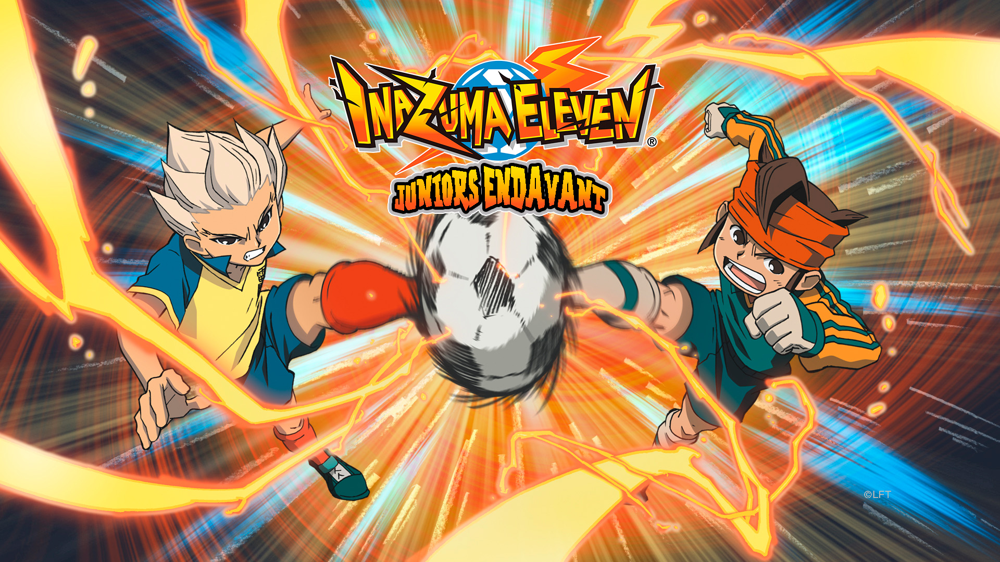
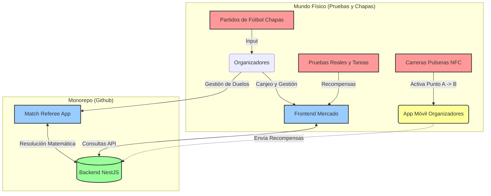
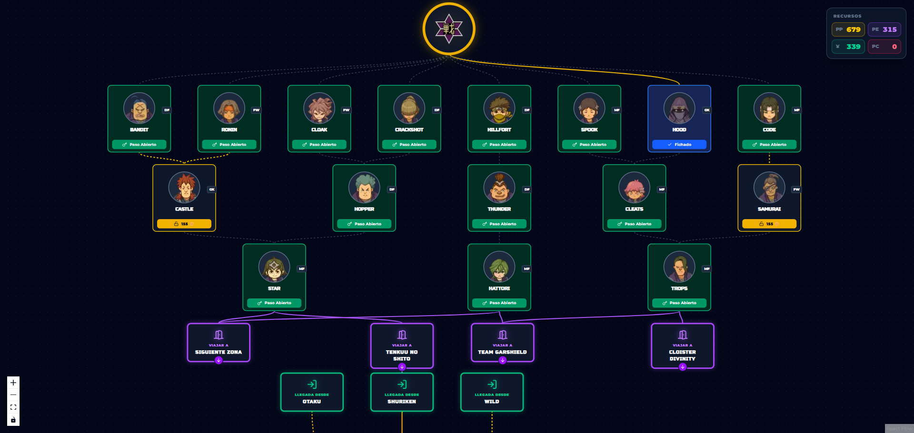
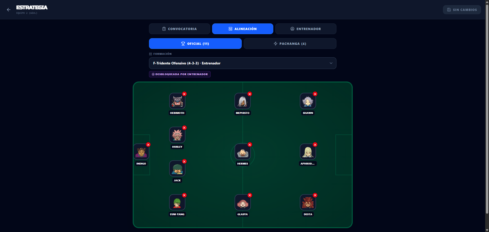
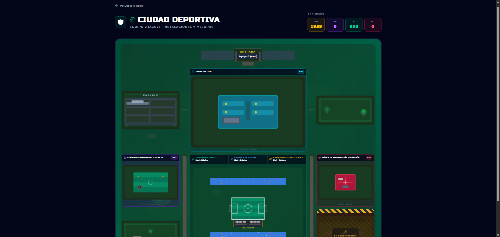
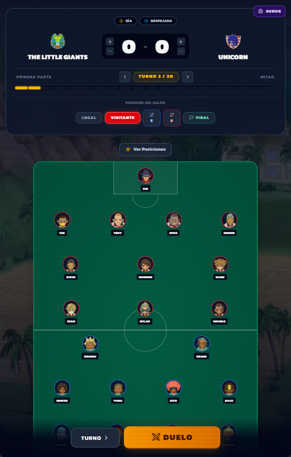
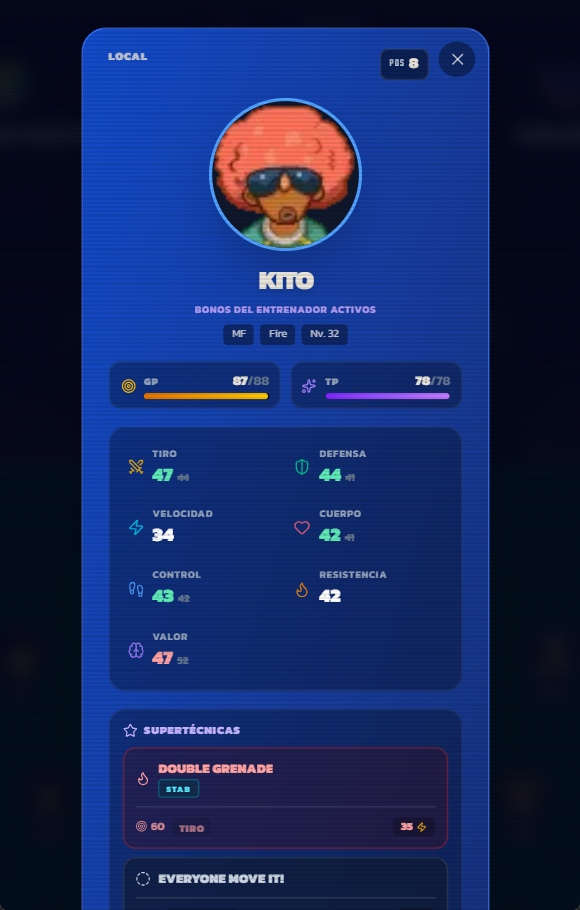
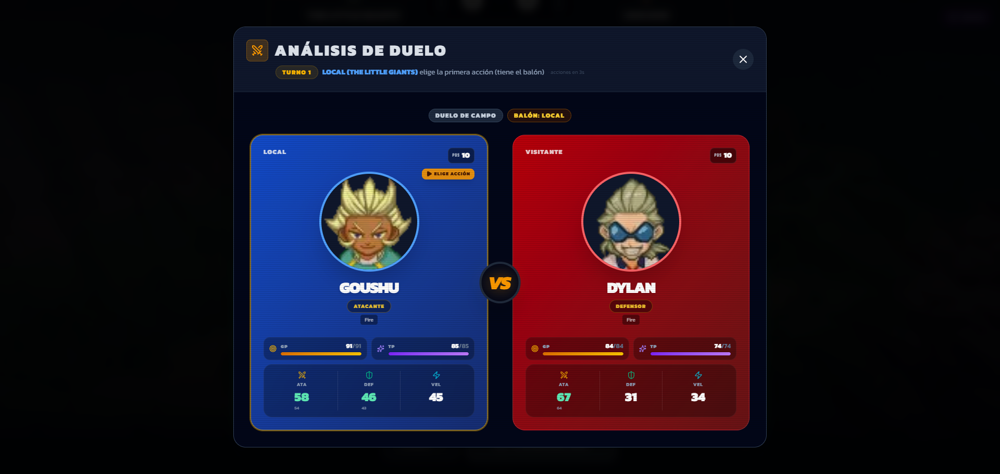
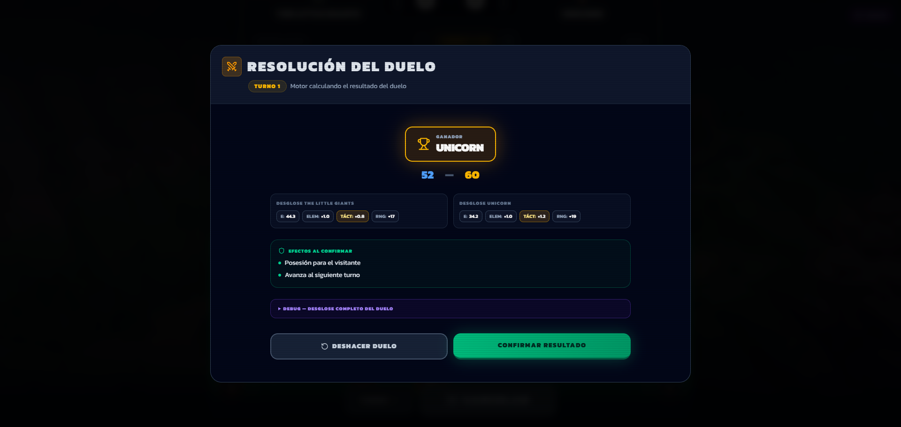

  
  
  <h1>Inazuma Eleven Endavant: Web Platform</h1>
  
  

    
    
    
    
    
    
  

Bienvenido al ecosistema central de **Inazuma Eleven Endavant**, una plataforma full-stack diseñada para dar soporte a una **experiencia de juego híbrida (físico-digital)** sin precedentes. 

Este proyecto no es solo un videojuego tradicional; es el motor digital que gestiona un inmenso juego de rol en vivo y partidos de **fútbol chapas** para campamentos y actividades educativas. Mientras los jugadores (los participantes) se enfrentan físicamente en la mesa moviendo sus chapas en estadios y ganan recursos mediante pruebas reales, este ecosistema actúa como el árbitro infalible, el mercado global, la calculadora de estadísticas RPG y el gestor del progreso de los clubes.

Este repositorio es un **monorepo** (gestionado con `pnpm workspaces`) que contiene las aplicaciones principales web y la API central.

---

## 🌍 Visión General de la Experiencia Híbrida

La plataforma traduce el complejo mundo de *Inazuma Eleven* a la vida real. La experiencia global se basó en los siguientes pilares:

1. **Partidos Físicos y Árbitros Digitales**: Los niños jugaban al fútbol en la mesa con chapas. El software recibía las métricas (stats, distancia, elementos, afinidades de los personajes ficticios de Inazuma) y sintetizaba matemáticamente el ganador del choque entre dos chapas.
2. **Obtención de Recursos Real**: Los chavales no ganaban oro "farmeando" en un videojuego, sino completando pruebas reales en el campamento o utilizando pulseras NFC.
3. **Economía Híbrida**: Con esos recursos ganados físicamente, usaban el Mercado (app) para comprar/vender jugadores, entrenadores o cambiar alineaciones.

### 📚 Manual del Jugador y Reglas Físicas

Al tratarse de una experiencia que combina la gestión digital con un juego físico, el sistema cuenta con reglas muy detalladas para el posicionamiento en la mesa, los turnos, las penalizaciones de clima, el cálculo de las supertécnicas y la economía del campamento.

📄 **[Haz clic aquí para consultar el Manual del Jugador completo (PDF)](./docs/Manual_del_Jugador.pdf)**

---

## 🏗️ Estructura del Monorepo

Este repositorio central alberga las siguientes tres aplicaciones principales.

### 📱 Frontend (El Mercado y Gestión)
Aplicación para que los participantes pudieran canjear sus recursos, mejorar sus clubes, gestionar alineaciones y ojear jugadores.

  
  
<i>Ejemplo del Árbol de Scouting (Mapa de Relaciones)</i>

  
  
<i>Ejemplo de la Pizarra Táctica</i>

  
  
<i>Ejemplo de la Ciudad Deportiva</i>

* **Tecnologías**: Next.js (TypeScript), Tailwind CSS.
* **Despliegue**: Desplegado en **Vercel** como una **PWA (Progressive Web App)**, enfocada al diseño *Mobile First* y preparada para funcionar bajo un esquema *Offline First* (vital en entornos de campamento con mala conexión).
* **Características Clave**:
  * **Mercado**: Compra/venta de jugadores, entrenadores y objetos con los recursos físicos canjeados.
  * **Pizarra Táctica**: Interfaz para declarar los 11 (o 4) jugadores, definir entrenador y equipar objetos.
  * **Mapa de Relaciones**: Un árbol visual para investigar las conexiones entre jugadores y pagar "peajes" para desbloquear estrellas del *lore*.

### ⏱️ Match Referee (El Árbitro Digital)
Aplicación cliente especializada para usarse por los organizadores a pie de campo (en la mesa de chapas).

  
  

  
<i>Vistazo general de la aplicación</i>

  
  
<i>Estadísticas y información antes de un duelo</i>

  
  
<i>Desglose de estadísticas y resultado de un duelo</i>

* **Tecnologías**: Next.js (TypeScript), Tailwind CSS, Zustand, Framer Motion.
* **Despliegue**: Al igual que el Frontend, desplegado en **Vercel** como **PWA Mobile y Offline First**.
* **Características Clave**:
  * **Motor de Duelos Súper Detallado**: Toma la ingente cantidad de información estática de Inazuma Eleven (stats, afinidades elementales, poder base) y resuelve empates y choques aplicando RNG, bonos de clima y ventajas de las supertécnicas.
  * **Gestión de Fatiga**: Rastrea el consumo de GP (Stamina) y TP en tiempo real durante los partidos de chapas.

### ⚙️ Backend (API Central)
El cerebro de la infraestructura. Valida todas las acciones, orquesta la economía híbrida y aplica la compleja lógica de progreso RPG de los personajes.
* **Tecnologías**: NestJS, Prisma ORM.
* **Base de Datos**: **PostgreSQL** alojada en **Neon**.
* **Despliegue**: Desplegado en **Railway**.

#### Vistazo Técnico: El Ciclo Elemental
El backend maneja automáticamente el ciclo de ventajas que aplica un multiplicador de `x1.1` (Ventaja) o `x0.9` (Desventaja) en los duelos:

| Fuego 🔥 | Bosque 🌳 | Aire 🌪️ | Montaña ⛰️ |
|:---:|:---:|:---:|:---:|
| Gana a Bosque | Gana a Aire | Gana a Montaña | Gana a Fuego |

---

## 🔗 Ecosistema Extendido (Fuera de este Repositorio)

Para dar vida al evento, este ecosistema web se apoyaba en herramientas adicionales que residen fuera de este monorepo:

### 1. Aplicación de Recolección NFC (React Native)
Se creó una app en **React Native (con Expo)** exclusiva para los organizadores, distribuida como un `.apk`. 
* **Mecánica**: Estaba ligada a una prueba de esfuerzo. Los chavales llevaban una pulsera NFC. Acudían a un punto "A" donde un organizador les escaneaba la pulsera para "activarla". A continuación, debían correr hasta un punto "B", donde otro organizador escaneaba la pulsera para "consumir" la activación, inyectando automáticamente una cantidad configurable de recursos en sus cuentas.
* *Nota: Esta app cuenta con su propio repositorio en GitHub independiente al monorepo.*

### 2. Scripts de Datos y Scrapers (Python)
Para poblar la inmensa base de datos del Backend con las estadísticas, movimientos y caras de los jugadores, se desarrollaron 3 scripts en **Python**.
* **Scraper**: Descargaba automáticamente miles de *sprites* e imágenes de los jugadores desde internet.
* **Normalización y Combinación**: Dos scripts que procesaban bases de datos de distintos juegos de la saga Inazuma Eleven, combinando y comparando estadísticas y movimientos (técnicas) para crear un *lore* balanceado, normalizado y unificado para nuestro motor de juego.
* *Nota: Estos scripts de utilidad se corrieron localmente y no están subidos a GitHub.*

---

## 🧩 Shared (Librería Core del Monorepo)

**`@inazuma/shared`** unifica el lenguaje dentro del monorepositorio, exportando los tipos de TypeScript y los esquemas generados por Prisma. Garantiza que el Frontend y el Referee compartan exactamente la misma estructura de datos que el Backend (resolviendo conflictos de tipado en tiempo de compilación).
